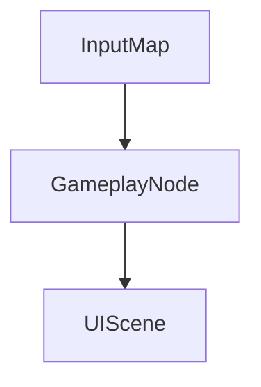

# Архитектура контура `<feature_id>` (Godot)

Справочник по сценам/нодам/сигналам контура. Меняется в одном
изменении с кодом.

1. Обзорная схема
2. Контракты данных / ресурсов
3. Карта сцена/скрипт ↔ ответственность
4. Потоки (input → sim → view / сигналы)
5. Ошибки и краевые случаи
6. Платформенные ветки / export

## 1. Обзорная схема

- Сцены (`.tscn`) затронуты:
- Autoload затронуты:
- Export presets:

## 2. Контракты данных

| Источник / приёмник | Формат | Кто читает / пишет |
|---|---|---|
| (`.tres` / save `user://` / remote) | | |

## 3. Карта модулей

| Сцена / скрипт | Ответственность | Сигналы / зависимости |
|---|---|---|
| | | |

## 4. Потоки

Критический user path → какие ноды и сигналы участвуют.

## 5. Ошибки

Что fail-fast, что recoverable, что репортим в crash/analytics.

## 6. Платформы

PC-only / mobile-only ветки, InputMap различия, export notes.
