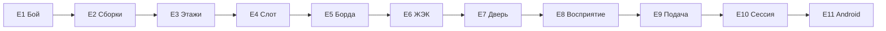

# spec.md — программа этапов «Окраина»

Источник истины **порядка разработки**: как из текущего greybox
получается цельная игра, в которую хочется зайти ещё раз.
Не код. Не GDD систем. Не lore bible.

Мир: [`docs/world/`](../world/). Текущий цикл: [`game/docs/vertical_slice/spec.md`](../../game/docs/vertical_slice/spec.md).
Исполняемый указатель: [`docs/world/ROADMAP.md`](../world/ROADMAP.md) — только индекс; стадии живут здесь.

## Цель

Зафиксировать одну последовательность этапов, по которой следующий агент
делает из пустого по ощущению билда **современную top-down action-roguelite**:
читаемый бой, сборка внутри забега, дом, который помнит, подача одного
произведения. Планка — Windows. Android — готовность ввода в конце, не
критерий «интересно».

Сейчас на `main` уже есть lore bible v0.1 и playable greybox
(квартира → подъезд → три этажа → melee → смерть или выход → один
meta-boon → строка ЖЭКа и `/pod/` → осмотр двери за кухней).
Это доказательство цикла. Это ещё не игра по планке ниже.

## Граница

### Входит

- Определение планки «качественно и интересно» для этого продукта
- Порядок этапов E1–E11: один этап = один класс router
- Вход, выход, зависимости, гейты и путь артефактов каждого этапа
- Правило, какой этап стартовать следующим (E1)
- Замена прежней последовательности R1→A1 из `docs/world/ROADMAP.md`

### Не входит

- Реализация любого этапа
- Спеки систем (бой, сохранения, борда, …) — их пишет этап, когда стартует
- Полный GDD, формулы статов, лут-таблицы, арт-пайплайн
- Store, IAP, tag, GitHub Release (классы `deploy`, `incident`, `release` выключены)
- Закрытие B1 / B2 / B3 (`docs/world/assumptions.md`)
- iOS, онлайн, Поезд как hub

## Поведение

1. Следующая работа по игре — **E1**, не старый R1 (сборки). Сборки без
   читаемого боя не делают забег интересным.
2. Этап исполняют по своему классу: корневой `AGENTS.md` → router → один
   рецепт → `game/AGENTS.md`. Этот файл не заменяет спеку этапа.
3. В один PR не тащат scope следующего этапа.
4. Параллелить этапы, которые правят `apartment_hub`, нельзя.
   E5 → E6 → E7 идут подряд.
5. Игроку по-прежнему нельзя выдать единственный ответ на тайну.
   Тон — ЖЭК, тред, быт (`docs/world/LORE.md`).
6. AUTHOR TRUTH не цитировать в player-facing тексте этапов.
7. Пока человек явно не вычеркнул этап, критический путь линейный.
   Вычеркнутый этап снимает только свои зависимости (см. assumptions A6).
8. Дисковое сохранение появляется в E4 и до этого не обещается.
   Инвариант `game/AGENTS.md` «нет дискового save» снимает **спека E4**,
   не этот документ и не более ранний этап.
9. Классы `hotfix` / `review-only` / `admin` берутся по событию и не
   вставляются в критический путь как «следующая фича».

## Планка качества

Проверяется на **выходе E10**. Не является приёмкой этого `spec-only`.

Игрок на Windows за один запуск проходит три забега подряд и может
показать:

1. Удар врага виден заранее, и его можно не получить защитным действием из E1.
2. Выбор внутри забега меняет то, как ощущается этот же забег.
3. Последовательность пресетов этажей этого забега не совпадает с предыдущим.
4. Квартира после возврата хранит след: борда, объявление ЖЭКа или
   состояние двери — и этот след на месте после перезапуска процесса (E4).
5. Квартира и этаж различаются с первого взгляда; в кадре нет
   player-facing серых прямоугольников и дефолтной иконки Godot.
6. Попадание, урон, смерть и выход слышны.
7. Пауза открывается и закрывается; мягкого замка на этих трёх забегах нет.
8. Тексты остаются канцеляритом и тредами. Игра не объявляет верную теорию мира.

Ориентир длины одного забега — 8–15 минут (A8, не гейт этой спеки).
Числа FPS — в спеке E10 (A9).

## Стадии

Фазы ниже — оглавление. Исполняют этапы, не фазы.

```text
E1 → E2 → E3 → E4 → E5 → E6 → E7 → E8 → E9 → E10 → E11
```

| ID | Фаза | Одним предложением |
|---|---|---|
| E1 | Забег | Бой читается |
| E2 | Забег | Сборка внутри забега |
| E3 | Забег | Этажи и враги не одна шутка |
| E4 | Дом помнит | Один слот сохранения |
| E5 | Дом помнит | Имиджборда даёт лид |
| E6 | Дом помнит | Объявление ЖЭКа давит на следующий забег |
| E7 | Дом помнит | Дверь за кухней открывается по состояниям, без ответа |
| E8 | Произведение | Восприятие показывает лишнее |
| E9 | Произведение | Картинка и звук одного мира |
| E10 | Сессия | Windows-сессия держит планку |
| E11 | Платформа | Android запускается с пальца, без store |

### E1 — Бой, который читается

| Поле | Содержание |
|---|---|
| **Класс** | `feature-cycle` |
| **Почему router** | Новый путь игрока: выжить, прочитав атаку. Сейчас враг только догоняет и наносит урон касанием |
| **Цель** | Есть одно защитное действие; хотя бы одна атака врага имеет подготовку; попадание и получение урона видны |
| **In** | Одно защитное действие (какое — выбирает спека E1); телеграф одной атаки; вспышка или hitstop; обратная связь урона по игроку. Смерть и выход в квартиру живы |
| **Out** | Ветки оружия, список комбо, элита, набор анимаций (это E9) |
| **Входы** | `game/docs/vertical_slice/`, `docs/world/LORE.md` (тон, не формулы) |
| **Артефакты** | Issue `class:feature-cycle,platform:pc,type:design` → `stage:analysis`…; `game/docs/combat_feel/spec.md`, `assumptions.md`, `DESIGN.md`, `ARCHITECTURE.md`, `review.md`, `test-report.md` |
| **Exit** | Путь: увидел подготовку → не получил урон → ударил. Headless: телеграф → защита → HP игрока не падает на этом ударе. Регрессия death/extract зелёная. В spec E1 названа форма ввода защитного действия: одна кнопка либо стик и кнопка. Эта форма — touch-эквивалент для E11; сам touch в E1 не делается |
| **Зависимости** | Текущий core на `main` |
| **Гейты** | нет |

### E2 — Сборка внутри забега

| Поле | Содержание |
|---|---|
| **Класс** | `feature-cycle` |
| **Почему router** | Новый путь: выбор способности или предмета **во время** забега, не только boon после |
| **Цель** | Каждые N убийств или этаж — выбор из 3 офферов; выбор меняет текущий забег так, что это видно в бою E1 |
| **In** | Один тип оффера; 8–12 офферов; UI выбора; задеты две оси из ТЕЛО / НЕРВ / защитное действие E1 |
| **Out** | Diablo-лут, сеты, крафт, четыре архетипа, все четыре стата |
| **Входы** | E1; `docs/world/LORE.md` §11 как крючок, без формул |
| **Артефакты** | `game/docs/run_builds/` |
| **Exit** | Путь: получил оффер → выбрал → урон, скорость или эффект изменились в том же забеге. Headless: pick меняет стат. Death/extract живы |
| **Зависимости** | E1 |
| **Гейты** | нет. Офферы не объясняют, «что случилось с миром» |

### E3 — Забег не повторяет одну планировку

| Поле | Содержание |
|---|---|
| **Класс** | `increment` |
| **Почему router** | Дельта к живому `run_floor`: таблица пресетов и второй враг, не новый генератор |
| **Цель** | Два забега с разным seed не совпадают; второй враг читается иначе, чем первый |
| **In** | ≥6 layout-пресетов в `resources/`; второй тип врага со своим телеграфом; длина забега 4–6 этажей; seed в `GameState`; вес зон «обычные / смещение / техзона» по каркасу лора |
| **Out** | Бесконечный procgen-движок, босс-камера |
| **Входы** | E1, E2; `docs/world/LORE.md` §5 |
| **Артефакты** | Дельта `game/docs/vertical_slice/spec.md` или `game/docs/run_floors/`, если объём дельты перестанет помещаться; `test-report.md` |
| **Exit** | Два seed → две разные последовательности id пресетов. Совпадение пресетов при разном seed выход не проходит. Smoke убивает оба типа врагов. Эскалация в `feature-cycle` только если спека потребует отдельный генератор |
| **Зависимости** | E1, E2 |
| **Гейты** | нет |

### E4 — Один слот, который переживает выход

| Поле | Содержание |
|---|---|
| **Класс** | `feature-cycle` |
| **Почему router** | Новый технический контур: диск `user://`. Сейчас `GameState` только в памяти процесса |
| **Цель** | После перезапуска квартира помнит мета-состояние, которое уже есть, и то, что добавят E5–E7 |
| **In** | Один слот; поле версии; запись по возвращении в квартиру и при выходе; загрузка на старте. Миграция явная. Битый файл → новая игра с бытовой строкой, целый файл не затирать «заодно» |
| **Out** | Облако, несколько слотов, трактат о шифровании |
| **Входы** | E3; инвариант save в `game/AGENTS.md` |
| **Артефакты** | `game/docs/save_slot/`; в том же цикле — правка инварианта `game/AGENTS.md` |
| **Exit** | Headless: записал флаг → новый `GameState` → load вернул флаг. Порча файла не уничтожает предварительно скопированный целый слот в тесте |
| **Зависимости** | E3. Пропуск E3 только если человек вычеркнул этап (правило 7) |
| **Гейты** | Wipe сохранений игроков — гейт человека. На этом этапе игроков со слотом ещё нет; этап вводит формат и не стирает чужие данные |

### E5 — Имиджборда как система лидов

| Поле | Содержание |
|---|---|
| **Класс** | `feature-cycle` |
| **Почему router** | Новый путь: интерактивный `/pod/` (и заготовка `/hr/`) до забега. Лид может врать |
| **Цель** | В квартире открыть борду, прочитать 3–5 тредов, выбрать «проверить» — и старт забега получает модификатор |
| **In** | Список тредов и тело; посты от `last_result` / kills / floors. «Правдивый» лид совпадает с уже записанным итогом забега (этаж, смерть или выход, число убийств). «Ложный» этому итогу противоречит. «Тролль» зовёт не туда и всё равно пускает в забег. Метафизическая «правда о мире» здесь не проверяется и не пишется. Выбор пишется в слот E4 |
| **Out** | Клиент всех бордов, мультиплеер, настоящий HTTP |
| **Входы** | `docs/world/LORE.md` §6; hub-текст `/pod/` сейчас |
| **Артефакты** | `game/docs/imageboard/` |
| **Exit** | Путь: открыл борду → выбрал тред → забег с иным модификатором. Headless: правдивый лид совпадает с прошлым итогом, ложный — нет, оба могут стартовать забег. Тон короткий, без AUTHOR-спойлера. После перезапуска выбранный след на месте. Если меняется схема слота — версия слота растёт, целый слот прошлой версии загружается |
| **Зависимости** | E4 |
| **Гейты** | Нет отдельного гейта B1. Схема слота не подменяется веткой «битый файл → новая игра»: эта ветка только для файла, который не читается |

### E6 — Объявление ЖЭКа меняет следующий забег

| Поле | Содержание |
|---|---|
| **Класс** | `increment` |
| **Почему router** | Дельта к hub: лента объявлений получает правило, не новый журнал на весь город |
| **Цель** | Объявление после забега даёт игровой эффект на **следующую** попытку |
| **In** | 5–8 шаблонов; 2 эффекта (пример тона: штраф к весу или временный бонус из текста объявления); лог в квартире; эффект в слоте E4 |
| **Out** | Симуляция ЖКХ города, отдельная экономика объявлений |
| **Входы** | E5 (тот же hub); `GameState` / текст ЖЭКа сейчас |
| **Артефакты** | Дельта hub-спеки или `game/docs/zh_ek/`, если появится свой экран |
| **Exit** | После забега объявление меняет стат или правило следующего. Headless: флаг эффекта. Эскалация в `feature-cycle`, только если спека потребует отдельный журнал. Смена схемы слота мигрирует целый слот прошлой версии |
| **Зависимости** | E5 |
| **Гейты** | Новая игра вместо миграции целого слота — нельзя |

### E7 — Дверь за кухней без финала

| Поле | Содержание |
|---|---|
| **Класс** | `feature-cycle` |
| **Почему router** | Новый сюжетный путь: состояния двери и комната-копия |
| **Цель** | Три состояния крючка (закрыто → контур → можно войти). За дверью — копия квартиры около 2003: ПК и след аккаунта с годом 2002. 2–3 документа усиливают минимум две версии тайны |
| **In** | Сцена копии квартиры; ПК с годом 2002; 2–3 документа тоном «дело», не «lore entry»; состояние двери в слоте E4 |
| **Out** | Остальные версии квартир, отдельная ветка «найти сообщение на форуме», лок AUTHOR TRUTH, объявление верной теории |
| **Входы** | `docs/world/LORE.md` §8 (дверь → копия квартиры ~2003 → ПК → аккаунт 2002); `AUTHOR_TRUTH.md` только как правила письма |
| **Артефакты** | `game/docs/kitchen_door/` |
| **Exit** | Путь: первый выход → контур двери; следующие возвраты → вход в копию ~2003 → осмотр ПК (год 2002) → возврат в свою квартиру без вердикта. Headless: состояния 0→1→2 и флаг осмотра ПК переживают перезапуск. Схема слота мигрирует целый слот прошлой версии |
| **Зависимости** | E6 |
| **Гейты** | До кода E7 человек снимает B1 одним из двух способов: записывает MODEL (`STATUS: LOCKED`) либо явно пишет в assumptions этапа, что этап идёт при `STATUS: UNSET` и только процедурой противоречий. Без этой отметки E7 не стартует. E1–E6 этот гейт не держит. Комната не выбирает одну версию. Новая игра вместо миграции целого слота — нельзя |

### E8 — Восприятие как опасная прокачка

| Поле | Содержание |
|---|---|
| **Класс** | `feature-cycle` |
| **Почему router** | Новая ось и новый путь: увидел то, чего на низком пороге не было |
| **Цель** | Стат Восприятие; на порогах появляются или пропадают дверь, ложный силуэт, шум интерфейса. Игра при этом не «ломается» |
| **In** | 3 порога; 2 визуальных эффекта; источник стата — оффер E2 или мета после забега |
| **Out** | Полная формула четырёх статов и вся лестница угроз |
| **Входы** | `docs/world/LORE.md` §11; E2 |
| **Артефакты** | `game/docs/perception/` |
| **Exit** | Headless: низкий порог прячет объект; высокий показывает. Death/extract живы. Список намеренных глитчей — в assumptions этапа, иначе эффект только визуальный |
| **Зависимости** | E2, E7 |
| **Гейты** | нет, пока A6 не отвергнут. Отвергнут — этап снят, E9 стартует после E7 |

### E9 — Картинка и звук одного произведения

| Поле | Содержание |
|---|---|
| **Класс** | `feature-cycle` |
| **Почему router** | Новый тип игрового артефакта: направленная подача вместо greybox. Правило боя не меняется |
| **Цель** | Квартира и этаж читаются как места одного мира; удар, урон, смерть и выход имеют звук |
| **In** | Короткий срез направления в DESIGN этапа (палитра, силуэт, голос UI); замена player-facing отладочных прямоугольников и дефолтной иконки; два музыкальных пласта (квартира, забег); стингеры hit / hurt / death / extract. Оверлеи E8 используют ту же палитру |
| **Out** | Катсцены, озвучка, полный цикл анимаций, капсулы для store, чужие ассеты без лицензии |
| **Входы** | Сцены E1–E8 |
| **Артефакты** | `game/docs/presentation/` |
| **Exit** | Путь планки п.5–6 на сборке редактора: два места различимы, четыре события слышны. Техника рисунка — решение спеки E9 (A7) |
| **Зависимости** | E8 (или E7, если A6 отвергнут) |
| **Гейты** | нет |

### E10 — Сессия на Windows держит планку

| Поле | Содержание |
|---|---|
| **Класс** | `feature-cycle` |
| **Почему router** | Пауза и первая минута — новый путь игрока. Живой спеки сессии до E10 нет, поэтому это не `increment` |
| **Цель** | Три забега подряд на Windows проходят планку этого файла |
| **In** | Пауза; ввод задокументирован или переназначается; первая минута говорит голосом мира (объявление или сама дверь подъезда), без плашки «нажмите WASD»; читаемый HUD; проход известных дыр. В спеке этапа записать числа performance budget (сейчас в проекте TBD) |
| **Out** | Страница в store, достижения, класс `release`, новый арт сверх E9 |
| **Входы** | `test-report` E1–E9; планка выше |
| **Артефакты** | `game/docs/windows_session/`; Issue `class:feature-cycle,platform:pc,type:design` |
| **Exit** | Ручной чеклист трёх забегов по планке + полный headless suite зелёный. Точечный `hotfix`, если чинится уже обещанный путь |
| **Зависимости** | E9 |
| **Гейты** | нет. Это не ship |

### E11 — Android: палец и preset, без магазина

| Поле | Содержание |
|---|---|
| **Класс** | `feature-cycle` |
| **Почему router** | Новый путь ввода: touch вместо клавиатуры и мыши |
| **Цель** | Игра запускается на Android-эмуляторе или устройстве: движение, атака и защитное действие E1 с пальца. Export preset в репозитории, без секретов |
| **In** | Виртуальный стик или кнопки под форму ввода из spec E1; safe area; `export_presets.cfg` без ключей. Увод в background и возврат оставляют ту же сцену. Убийство процесса и новый запуск грузят целый слот, не стирая его |
| **Out** | Google Play, signing в CI, классы `deploy` / `release`, internal track |
| **Входы** | E10; форма ввода из spec E1; платформы в корневом `AGENTS.md` |
| **Артефакты** | `game/docs/android_touch/`; labels `platform:mobile` или `platform:both` |
| **Exit** | Команда export записана без секретов. Desktop smoke зелёный. На эмуляторе или устройстве пальцем выполнены движение, атака и защитное действие E1; прогон только мышью этот выход не закрывает. Background → resume оставляет ту же сцену. Новый запуск после убийства процесса поднимает целый слот. Имя среды и результат этих путей — в `test-report` |
| **Зависимости** | E10 |
| **Гейты** | Signing, store credentials, prod-track — человек. В этапе только preset |

## Соответствие прежнему ROADMAP

Прежняя цепочка R1→R2→R3→R4→R5→R6→P1→A1 **не исполняется**.
Её закрывал указатель в `docs/world/ROADMAP.md` до этой спеки.

| Было | Стало | Что изменилось |
|---|---|---|
| — | E1 | Бой вынесен вперёд: greybox-melee не база для сборок |
| R1 сборки | E2 | После читаемого боя |
| R5 этажи | E3 | Сразу после сборок, пока забег ещё главный предмет |
| — | E4 | Диск до мета-систем. Раньше сохранения в плане не было |
| R2 борда | E5 | После слота |
| R3 ЖЭК | E6 | Как increment к hub |
| R4 дверь | E7 | Состояния переживают перезапуск |
| R6 восприятие | E8 | На критическом пути |
| — | E9 | Подача была вне плана («красивый арт» = out) |
| P1 polish | E10 | Класс стал `feature-cycle`: пауза — новый путь, не дельта greybox |
| A1 Android | E11 | Выход требует палец на эмуляторе или устройстве и resume, не отметку в отчёте |

## User paths

Колонка **Exit программы** — входит ли путь в приёмку этого `spec-only`.

| Путь | Актор | Успех | Ошибка | Exit |
|---|---|---|---|---|
| PA1 Следующий этап | Агент | Берёт ровно E1, класс `feature-cycle`, артефакты в `game/docs/combat_feel/` | Стартует E2 или старый R1; включает `release`; закрывает B1 | yes |
| PA2 Чтение планки | Автор / агент | Называет планку E10 и список «не входит» | Считает greybox готовой игрой или этот документ — заявкой в store | yes |
| PA3 Три забега | Игрок | Проходит планку на выходе E10 | Softlock, немой greybox, один ответ на тайну | no (приёмка E10) |

## Платформы

- PC: Windows — планка E10
- Mobile: Android — E11, готовность, не store. iOS — после E11, вне этой программы
- Расхождения до E11: ввод и safe area не обещать. Бой E1 проектируется так, чтобы у защитного действия был touch-эквивалент в E11, без реализации touch в E1

## Контракты снаружи

- SoT мира: `docs/world/`
- SoT текущего цикла: `game/docs/vertical_slice/spec.md`
- SoT этой программы: этот файл
- Движок: Godot 4.7.2, GDScript, `game/`
- Save до E4: нет диска (`game/autoload/game_state.gd`)

## Дизайн-пакет

Отдельный `DESIGN.md` программы не заводится: цель, порядок и scope
этапов записаны здесь. Lore не дублировать.

Срезы systems / UX / tech каждый этап пишет у себя, когда стартует.

## Допущения

[`assumptions.md`](assumptions.md).

Блокеров аналитики, которые держат запись плана или старт E1, нет.
A6–A9 открыты и не блокируют E1.

## Диаграммы

Одна схема порядка (flowchart). C4 и sequence не нужны: программа не
вводит рантайм-узлы.



## GitHub

- Issue: нет URL. В этом цикле `gh` на Issues отвечает 403
  (`Resource not accessible by integration`). Контракт — файлы
  `docs/program/`, не чат. Когда появится доступ, открыть Issue
  шаблоном spec (`class:spec-only`, `platform:pc`, `type:design`)
  и вписать URL сюда. См. A18.
- Milestone: нет
- Этапы E1–E11 заводят свои Issue в момент старта. Пачкой их не открывать.
