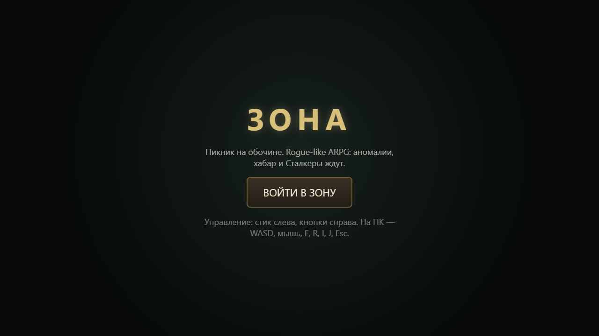
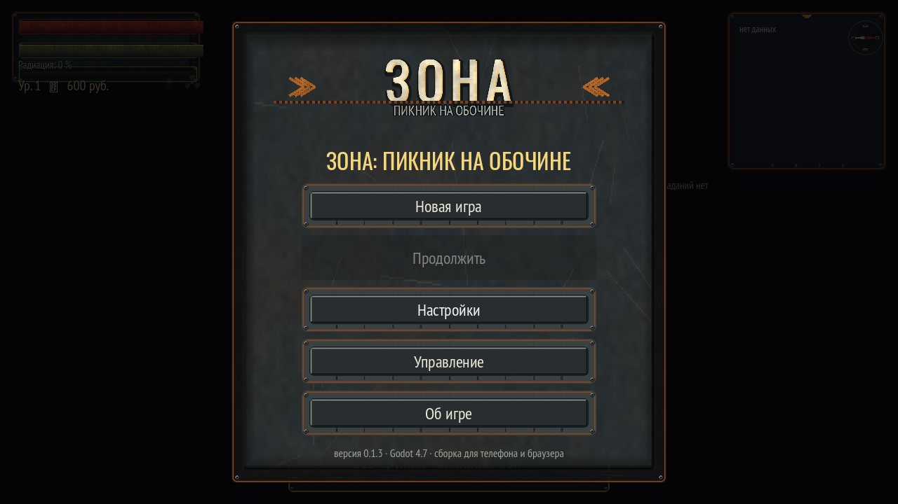
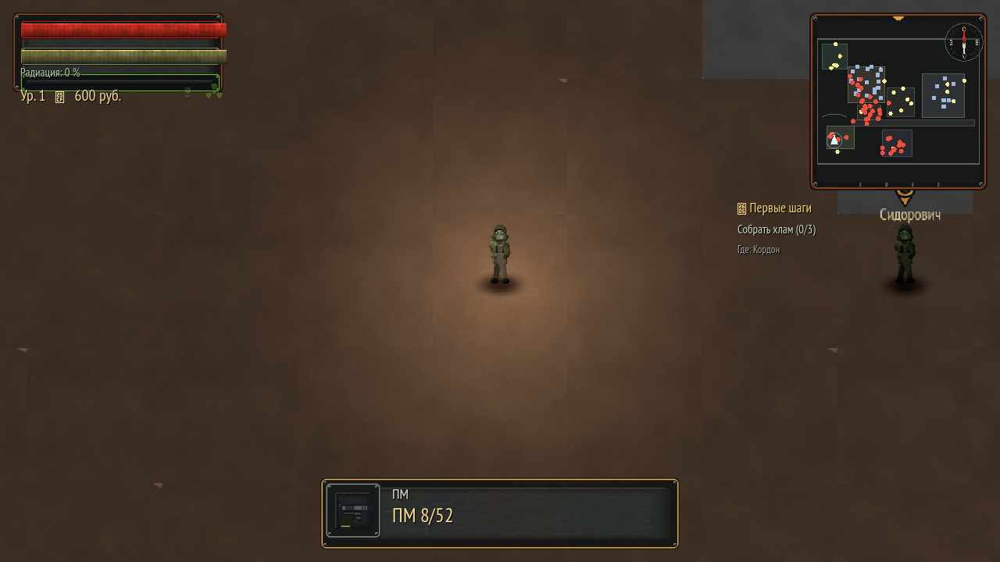
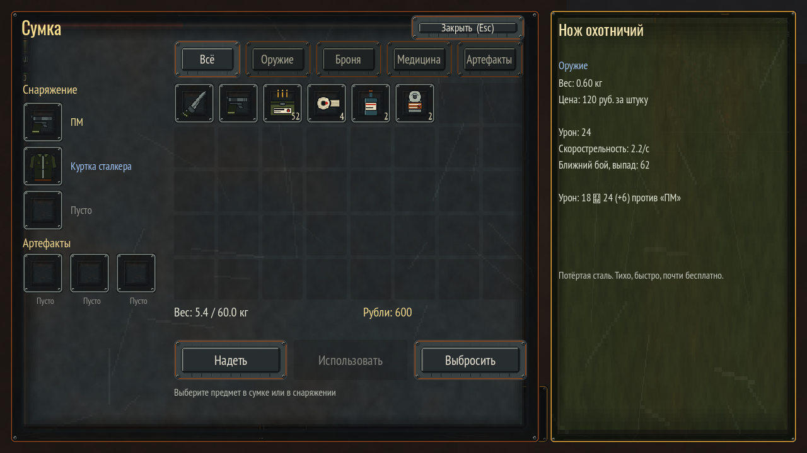
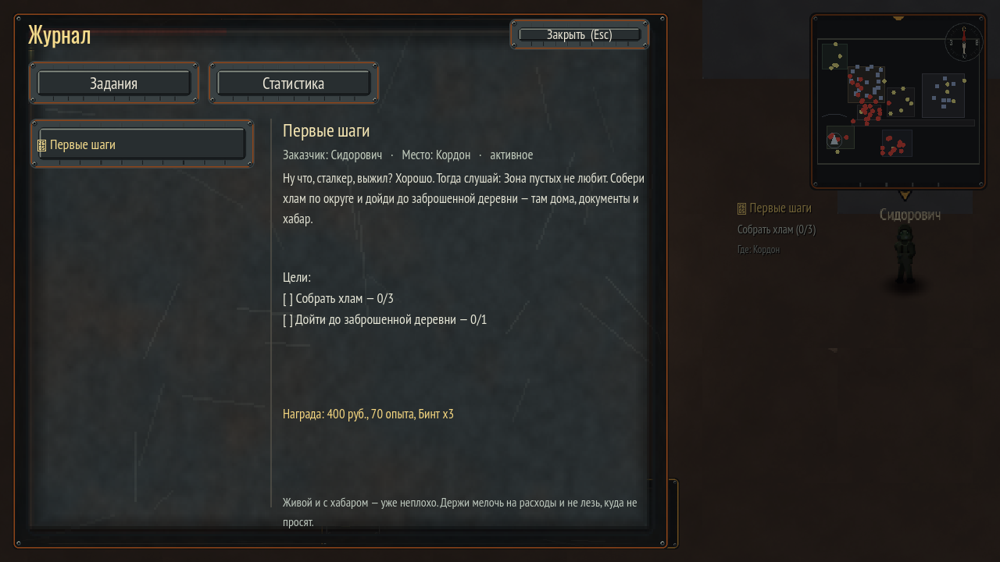
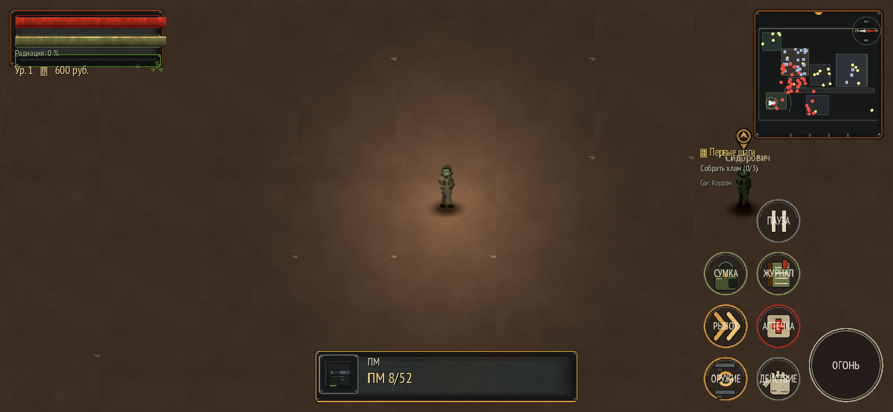

# ЗОНА: Пикник на обочине

Rogue-like ARPG в духе Diablo по мотивам «Пикника на обочине»: одна большая Зона,
аномалии, хабар, Сталкеры, мутанты и квестовая цепочка. Godot **4.7.2**, GDScript,
процедурная генерация всей графики и звука.

**Играть в браузере (телефон/ПК):** <https://31-130-128-81.sslip.io/>

## Скриншоты

Кадры сняты с живой веб-сборки 0.1.3; файлы лежат в [`../docs/screenshots/`](../docs/screenshots/).

| | |
|---|---|
|  |  |
|  |  |
|  |  |

## Что уже есть

- Одна большая бесшовная локация (~260x200 тайлов) из 5 зон: **Кордон, Деревня, Завод,
  Болото, Бункер** + аномальное поле; дороги, дома с проходимыми интерьерами, пропы
  с коллизиями, декали, контейнеры, NPC-заказчики.
- Главный герой-сталкер: движение, спринт, рывок, стрельба/ближний бой, фонарь,
  перезарядка, обыск контейнеров, подбор лута, здоровье/силы/радиация.
- 4 типа врагов (слепой пёс, кровосос, зомбированный сталкер, кабан) со своим ИИ,
  статами, лутом; боссы на Заводе и в Бункере.
- 4 типа аномалий (гравиконцентрат, электра, жарка, плод) с артефактами внутри.
- Инвентарь на 40 слотов, экипировка (оружие/броня/шлем/3 артефакта), применение медикаментов,
  вес, деньги, торговля хламом, отдых у костра.
- Квестовая цепочка из 8 основных заданий + 3 побочных, журнал, трекер, диалоги с NPC.
- HUD: здоровье/силы/опыт/радиация, патроны, миникарта, трекер заданий, лог событий,
  вспышка урона, детектор артефактов, всплывающие цифры урона.
- Мобильный интерфейс: два виртуальных стика и крупные кнопки, поддержка мультитача,
  главное меню/пауза/настройки/смерть, всё на русском.
- Сохранение прогресса (на web — в IndexedDB), сид мира восстанавливается из сохранения.

## Управление

| Действие | ПК | Телефон |
|---|---|---|
| Движение | WASD / стрелки | левый стик |
| Прицел и огонь | мышь + ЛКМ (удержание — автоогонь) | правый стик |
| Взаимодействие/подбор | **F** | кнопка «рука» |
| Перезарядка | **R** | авто при пустом магазине |
| Рывок | **Пробел** | кнопка «шевроны» |
| Аптечка | **H** | кнопка с крестом |
| Смена оружия | **Q** | кнопка с двумя стрелками |
| Сумка | **I** / **E** | кнопка «рюкзак» |
| Журнал | **J** | кнопка «блокнот» |
| Пауза/меню | **Esc** | кнопка «пауза» |
| Фонарь | **L** | — |
| Полный экран | **F11** | кнопка «ВОЙТИ В ЗОНУ» в браузере |

## Быстрый старт в редакторе

```powershell
cd <папка проекта>        # корень Godot-проекта (в этом репозитории — game/)
.\Godot_v4.7.2-stable_win64.exe --path .          # запустить игру
.\Godot_v4.7.2-stable_win64_console.exe --headless --path . --import   # импорт ассетов
```

Бинарники Godot 4.7.2 лежат либо рядом с `project.godot`, либо в `tools\godot\`
(каталог в `.gitignore`); `tools\deploy\build_web.ps1` ищет их в обоих местах.
Тесты запускаются от корня проекта:
`Godot_v4.7.2-stable_win64_console.exe --headless --path . -s res://tests/t_ui.gd`
(`t_combat.gd`, `t_world.gd` — так же).

## Сборка веб-версии и деплой

```powershell
# только сборка (импорт → самотест с проверкой скриптов → экспорт → проверка пака)
powershell -File tools\deploy\build_web.ps1

# сборка и выкладка на ВМ (nginx + сертификат Let's Encrypt)
powershell -File tools\deploy\build_web.ps1 -Deploy

# самотест в окне со скриншотами (tools\gen\_out\game_shot_*.png)
powershell -File tools\deploy\build_web.ps1 -Selftest
```

Скрипт рассчитан на Windows PowerShell 5.1 и хранится в UTF-8 **с BOM** (без BOM 5.1 читает
русские комментарии как cp1251 и падает на разборе файла). Внешние процессы он запускает через
`Start-Process` с перенаправлением stdout/stderr в файлы: при `2>&1` PowerShell 5.1 с
`$ErrorActionPreference='Stop'` обрывается на первой же строке stderr Godot, а `cmd /c "... 2>&1"`
теряет часть вывода движка.

`exclude_filter` пресета не пускает в `index.pck` ничего из `tools/gen/_out/` (превью
генераторов) и из `build/`: веб-экспорт кладёт в `build/web/` свои PWA-иконки и манифест,
и без этого они на **следующей** сборке попадали бы в пак как «ресурсы проекта»
(≈79 КБ мёртвого веса, накапливается с каждой сборкой).

Деплой-скрипт `tools/deploy/deploy.py` умеет по шагам: `probe`, `install`, `upload`,
`nginx`, `cert`, `verify` (или `all`). Креды ВМ читаются из `.env`
(строки `# ssh root@IP` и пароль). Сертификат выпускается через certbot/HTTP-01
в отдельной линии (`--cert-name zone-<ip>`), чужие сайты на ВМ не затрагиваются.

- Хостинг: nginx, статика из `/var/www/zone`, HTTP → HTTPS редирект, gzip.
- MIME: `.wasm` отдаётся как `application/wasm`, `.pck` — `application/octet-stream`.
- Бесплатный хостнейм: `<ip-с-дефисами>.sslip.io` (проверяется резолв; запасной вариант — `nip.io`).

## Процедурная генерация ассетов

Вся графика и звук генерируются питоновскими скриптами (numpy + PIL), ничего не скачано
из интернета; шрифты — OFL (PT Sans Narrow, Oswald).

```powershell
cd tools\gen
$env:PYTHONIOENCODING='utf-8'
python gen_ground.py     # атласы земли/стен/декалей + нормал-мапы
python gen_sprites.py    # персонажи, враги, пропы, аномалии, эффекты
python gen_ui.py         # панели, кнопки, иконки предметов, логотип
python gen_audio.py      # 49 звуков/эмбиентов/музыки (WAV)
```

Общая библиотека — `tools/gen/paint.py` (шум, worley, кракле, запечка света, нормал-мапы,
атласы, контактные листы). Результаты складываются в `assets/{textures,sprites,ui,audio}`,
превью для глаз — в `tools/gen/_out/`.

## Структура проекта

```
autoload/    assets.gd (реестр), game_state.gd (забег+сохранение), quests.gd, sfx.gd
scripts/     game.gd (корень), world.gd (генерация уровня), player.gd, enemy.gd,
             anomaly.gd, projectile.gd, loot.gd, container.gd (LootContainer), npc.gd,
             hud.gd, inventory_ui.gd, journal_ui.gd, menu_ui.gd, touch_ui.gd, dialog_ui.gd,
             item_db.gd (база предметов), damage_text.gd
scenes/      game.tscn (корневая сцена)
docs/        INTERFACES.md — контракты классов и API автолоадов
web/         head_include.html — мобильная HTML-обвязка для web-экспорта
tools/gen/   генераторы ассетов (paint.py + gen_*.py)
tools/deploy/ fetch_templates.py, deploy.py, build_web.ps1
tests/       probe_web.gd и тесты отдельных систем
```

## Проверка качества

- Проверка скриптов в `build_web.ps1` идёт через сам самотест (`--selftest` в headless):
  он ловит ошибки парсинга, которые `--check-only` не видит из-за автолоадов, и сборка
  останавливается на первой строке `SCRIPT ERROR`/`Parse Error`.
- Самотест игры: `godot --headless --path . -- --selftest` — строит мир, проверяет наличие
  врагов/аномалий/контейнеров, бой, лут, урон, аптечки, квесты, сохранение и печатает отчёт;
  с флагом `--shot` дополнительно сохраняет скриншоты в `tools/gen/_out/`.
- **Плейтест** `godot --headless --path . -- --playtest [--shot]` — 16 проверок игровых путей
  в живой игре: сумка и журнал, меню (пауза реально замораживает мир, настройки открываются
  поверх паузы, закрытие снимает паузу), диалог NPC с выдачей задания, обыск контейнера,
  артефакт из аномалии, убийства/лут/опыт, повышение уровня, закрытие задания и переход к
  следующему, сохранение/загрузка, аптечка и антирад (exit code 0 = всё зелёное).
- `python tools/deploy/check_pck.py` — разбор `build/web/index.pck`: показывает число файлов,
  наличие всех ключевых ресурсов (сцены, скриптов, шрифтов, атласов, спрайтов) и распределение
  по формам (.gdc/.ctex/.remap/…).
- `python tools/deploy/logs.py` — что реально происходит на сервере: запросы `index.*`,
  размеры отданного wasm, топ клиентов.
- Контактные листы ассетов в `tools/gen/_out/sheet_*.png` — визуальная проверка графики.

## Мобильный браузер: что сделано специально

- **Рендер-профили.** Десктоп — `forward_plus` + HDR/glow/MSAA; **web — `gl_compatibility`**
  (лёгкий и совместимый с WebGL2 на телефонах), **мобильные — `mobile`**. Профили
  качества (`Низкое/Среднее/Высокое`) переключаются в настройках: меняются зум камеры,
  свечение, MSAA, HDR.
- **Адаптивный рендер:** `stretch mode = canvas_items`, `aspect = expand`, базовое
  разрешение 1280x720, канвас подстраивается под окно браузера (`canvas_resize_policy = adaptive`),
  поэтому ультраширокие экраны телефонов не обрезаются.
- **Само-детект слабого устройства:** на web/тач-устройствах с маленьким экраном или
  высоким DPI игра стартует на «Низком» качестве.
- **Экономия CPU:** враги включают физику и отрисовку только в радиусе ~2100 px
  (остальные спят), эффекты переиспользуют пулы звуковых плееров.
- **Тач-управление:** левый стик — движение (появляется под пальцем, мёртвая зона 12 px),
  правый стик — прицел и огонь, крупные кнопки: огонь, действие/подбор, рывок, аптечка,
  смена оружия, сумка, журнал, пауза. Одновременно работают клавиатура и мышь.
- **Автоподбор мелочи** (патроны, медикаменты, еда) — на телефоне экономит десятки тапов.
- **HTML-обвязка** (`web/head_include.html`): `viewport-fit=cover`, отступы под «челку»
  и жесты (safe-area), запрет прокрутки/зума/контекстного меню, экран «ВОЙТИ В ЗОНУ»
  (он же разблокирует звук и запрашивает полный экран), подсказка повернуть телефон
  в ландшафт, PWA-манифест (можно добавить игру на домашний экран).
- **Сборка без потоков** (`thread_support = false`) — не нужны заголовки COOP/COEP,
  игра работает на любом хостинге и в мобильных браузерах без SharedArrayBuffer.

## История версий

Текущая версия: **0.1.3** — лежит в `project.godot` (`application/config/version`)
и показывается в главном меню и на экране «Об игре». Полная хронология — в
[CHANGELOG.md](CHANGELOG.md).

- **0.1.3** (25.09.2026) — кнопки тач-слоя не зависят от того, как платформа
  помечает события (мышь и палец работают, двойных срабатываний нет); экранные
  кнопки в браузере включаются на узком окне; в сборку больше не уезжает мусор
  инструментов и превью генераторов — `index.pck` 15.92 → 5.90 МБ (в 2,7 раза),
  первая загрузка пака (gzip) — ~2 с вместо ~3,5.
- **0.1.2** (25.09.2026) — звук в браузере: обвязка возобновляет `AudioContext`
  на первом жесте (политика автоплея) и защищает граф аудиошин от обрыва выхода
  Master и циклов, из-за которых веб-сборка была беззвучной.
- **0.1.1** (25.09.2026) — исправлен ввод: синхронизация игрока со слоем касаний
  (тач-управление), кнопки вариантов ответа в диалогах, двойные срабатывания
  кнопок тач-слоя.
- **0.1.0** — первый игровой срез: Зона, аномалии, квесты, мобильный интерфейс,
  веб-сборка и деплой.

