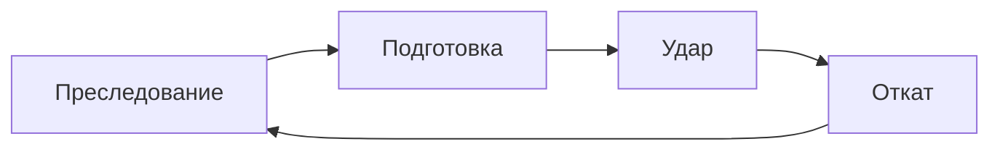

# spec.md — combat_feel (E1)

Источник истины поведения боя, который читается.
Программа: [`docs/program/spec.md`](../../../docs/program/spec.md) этап E1.
Текущий цикл: [`../vertical_slice/spec.md`](../vertical_slice/spec.md).

## Цель

Игрок на этаже гигахруща видит подготовку удара и может не получить
этот удар одним нажатием. Попадание по врагу и получение урона видны.
Смерть и выход в квартиру остаются.

## Граница

### Входит

- Одно защитное действие `dodge`: шаг в сторону взгляда и краткая неуязвимость
- Одна атака врага с подготовкой, затем один удар
- Вспышка на подготовке врага, на попадании игрока по врагу и на полученном уроне
- Форма ввода для будущего touch: **одна кнопка** (не стик+кнопка)
- Headless-проверка: подготовка → dodge → HP не падает

### Не входит

- Ветки оружия, комбо, элита, второй тип врага
- Набор анимаций и звук (E9)
- Touch-реализация (E11)
- Сборки внутри забега (E2)
- Смена числа этажей, лут, AUTHOR TRUTH

## Поведение

1. Враг преследует игрока. В зоне удара он останавливается и входит в подготовку.
2. Пока идёт подготовка, цвет врага — янтарный. Урона в подготовке нет.
3. В конце подготовки враг наносит один удар, если игрок всё ещё в зоне удара.
4. `dodge` по действию `dodge` (клавиша Shift): игрок смещается на 0.16 с
   вдоль последнего ненулевого взгляда. Взгляд не читается заново в кадр
   нажатия. Если игрок ещё не двигался, взгляд — вправо.
5. Нажатие во время подготовки, пока игрок в зоне этого врага, закрывает
   удар этой подготовки: HP не меняется, даже если к моменту удара шаг
   уже кончился и игрок всё ещё в зоне. Окно не длиннее 0.50 с от нажатия.
   Если подготовки нет, неуязвимость равна только 0.16 с шага.
6. Если закрытия нет и игрок в зоне, HP уменьшается на урон удара один раз,
   визуал игрока кратко краснеет. Закрытый удар красным не красится.
7. Попадание атаки игрока кратко белит визуал врага.
8. Перезарядка 0.70 с считается с кадра нажатия. Повтор до её конца,
   в том числе во время шага, игнорируется. Удержание клавиши не продлевает
   неуязвимость.
9. `take_damage` вне шага по-прежнему доводит HP до 0 и открывает смерть.
10. Выход с этажа и meta-boon не зависят от шага.

Числа (контракт проверки, не «на глаз»):

| Параметр | Значение |
|---|---|
| Подготовка | 0.50 с |
| Дистанция старта подготовки и зона удара | 56 px |
| Урон удара | 18 |
| Длительность шага | 0.16 с |
| Неуязвимость без подготовки | 0.16 с |
| Неуязвимость по подготовке | до удара этой подготовки, не дольше 0.50 с от нажатия |
| Откат врага после удара | 0.40 с, в откате не бежит и не начинает новую подготовку |
| Скорость шага | 520 px/с |
| Перезарядка шага | 0.70 с с кадра нажатия |
| Ввод | действие `dodge`, одна клавиша Shift. Взгляд — последний ненулевой вектор движения |

## User paths

| Путь | Актор | Успех | Ошибка |
|---|---|---|---|
| CF1 Уклониться | Игрок | Враг янтарный, игрок в зоне → Shift сразу → к моменту удара игрок всё ещё в зоне → HP тот же | Урон прошёл, потому что шаг кончился раньше удара |
| CF2 Принять удар | Игрок | Стоит в зоне, шаг не жмёт → HP −18 один раз | Урон капает каждый кадр, как раньше от касания |
| CF3 Ударить в ответ | Игрок | Атака уменьшает HP врага; добивание увеличивает `kills` | Атака не попадает в прежнюю зону |
| CF4 Смерть | Игрок | HP до 0 без шага → результат `death` | Softlock, смерть не наступает |
| CF5 Выход | Игрок | Жёлтая зона последнего этажа → `extract` | Шаг ломает переход |

## Платформы

- PC: Windows — must. Ввод: одна клавиша.
- Mobile: later. Эквивалент E11 — одна кнопка на то же действие `dodge`. В этом этапе кнопки нет.
- Расхождения: нет второй раскладки ввода до E11.

## Контракты снаружи

- `GameState.player_hp` / `finish_death` / `finish_extract` / `kills`
- Группы `player` и `enemies`
- Касательный DPS врага снят: урон только ударом после подготовки

## Дизайн-пакет

- [`DESIGN.md`](DESIGN.md)
- [`ARCHITECTURE.md`](ARCHITECTURE.md) — пишется вместе с кодом
- Lore-срез отдельным файлом не нужен

## Допущения

[`assumptions.md`](assumptions.md).

## Диаграммы

Одна FSM врага.

## GitHub

- Issue: нет URL. `gh` на Issues отвечает 403, как в программе (A18).
- Milestone: нет
